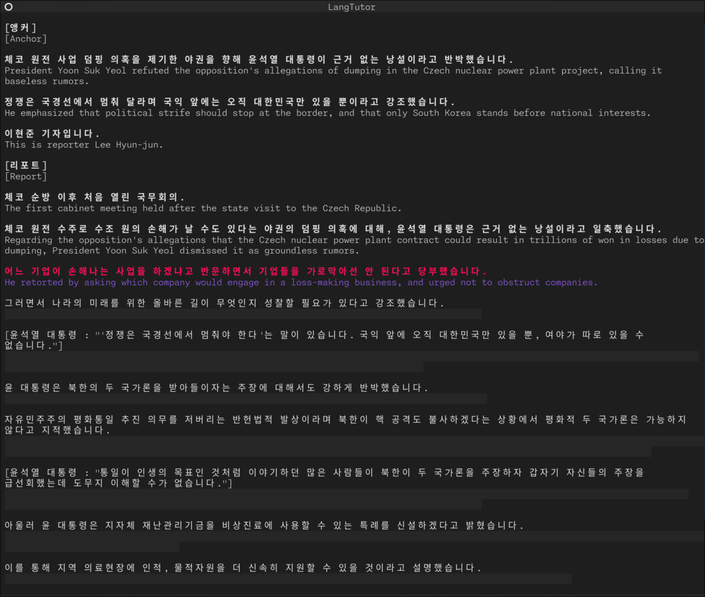

# LangTutor

A line-by-line news article extrator, translator, and viewer. Useful for language learning.



## Installation

First, clone this repository locally. It uses `oneping` for LLM interface, in addition to `textual` for the UI. To install these, run:

```bash
pip install -r requirements.txt
```

You'll need to have your API key set as an environment variable for non-local providers. For `anthropic`, this is `ANTHROPIC_API_KEY`. For `openai`, this is `OPENAI_API_KEY`.

## Usage

Basic usage:

```bash
python tutor_textual.py <url_or_file>
```

Press the up and down arrow keys to advance the translation through the article one sentence at a time. Additional options include:

- `--provider` - The LLM provider: `anthropic`, `openai`, or `local`. Defaults to `local`.
- `--save` - Save the extracted and translated output to a file to view later.
